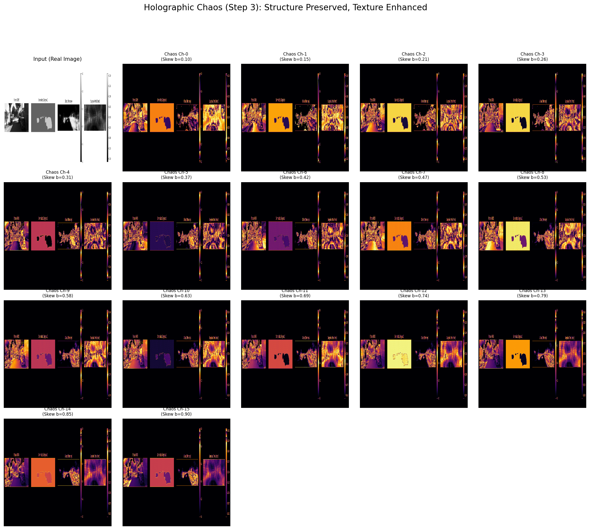

# Holographic Chaos: Experimental Feature Painting

## Project Goal
This project is an experimental test to investigate if deterministic chaotic dynamics can be effectively combined with 3D object detection pipelines. The primary goal is to determine if the **Skew Tent Map**, a system from chaos theory, can extract useful texture signatures from camera images to augment LiDAR data.

Initial tests on the KITTI dataset suggest that this combination is feasible and shows promise particularly for vulnerable road users (VRUs).


*(Above: Visualization of the Skew Tent Map dynamics. A single input texture (top-left) is processed by 16 slightly different chaotic maps.)*

---

## 1. Methodology

### Chaos-Based Feature Extraction
We map pixels to their physical texture dynamics using a **Coupled Map Lattice (CML)** framework. Each pixel's intensity serves as the initial condition ($x_0$) for a chaotic map.

**The Skew Tent Map**
We use the Skew Tent Map with a low iteration count ($N=2$) to preserve local structure while enhancing texture contrast:

$$
x_{n+1} = \begin{cases} 
x_n / b & \text{if } x_n < b \\ 
(1 - x_n) / (1 - b) & \text{if } x_n \ge b 
\end{cases}
$$

**Parameters**:
*   **$N=2$**: We iterate the map only 2 times. This creates a non-linear texture transformation rather than full chaotic mixing, ensuring valid local features for the backbone.
*   **$b \in [0.1, 0.9]$**: The skew parameter varies across channels, creating a diverse bank of texture filters.

**Hypothesis**: We posist that this deterministic non-linear expansion of the pixel intensity space highlights subtle variations in surface material effectively.

---

## 2. Quantitative Results

We evaluate our method on the **KITTI Validation Set** using standard Average Precision (AP).

### 2.1. Main Results (Standard AP)
*   **Car**: IoU 0.70
*   **Pedestrian/Cyclist**: IoU 0.50

| Method | Backbone | Class | Easy | Moderate | Hard |
| :--- | :---: | :---: | :---: | :---: | :---: |
| **Holographic Chaos** | **SECOND** | Car | 89.26 | 79.54 | 78.43 |
| (Voxel) | | Pedestrian | 70.84 | 67.72 | 63.19 |
| | | Cyclist | 83.10 | 81.97 | 80.22 |
| | | **mAP** | **81.07** | **76.41** | **73.95** |
| **Holographic Chaos** | **PointPillars** | Car | 90.19 | 86.56 | 84.74 |
| (Pillar) | | Pedestrian | 61.63 | 57.43 | 54.67 |
| | | Cyclist | 84.25 | 79.99 | 75.13 |
| | | **mAP** | **78.69** | **74.66** | **71.51** |

### 2.2. Ablation Study: Chaos vs. LiDAR-Only
Comparing against official OpenPCDet baselines (LiDAR-Only).

| Method | Backbone | Car (Mod) | Pedestrian (Mod) | Cyclist (Mod) | Gain w/ Chaos |
| :--- | :---: | :---: | :---: | :---: | :---: |
| **Baseline** | PointPillars | 77.28 | 52.29 | 62.68 | - |
| **+ Chaos** | PointPillars | 86.56 | 57.43 | 79.99 | +17.3% (Cyc) |
| | | | | | |
| **Baseline** | SECOND | 78.62 | 52.98 | 67.15 | - |
| **+ Chaos** | SECOND | 79.54 | 67.72 | 81.97 | +14.7% (Ped) |

---

## 3. Analysis

Our results reveal a trade-off between the 3D Backbone and the Chaotic Features.

### 1. The "Voxel" Advantage (SECOND) for VRUs
SECOND (Voxel-based) performs better for **Pedestrians (+10% vs Pillars)**.
*   **Hypothesis**: Voxels may preserve fine-grained 3D local structure better than pillars. The chaotic features for a pedestrian are high-frequency texture cues, and the voxel grid might retain these details more effectively.

### 2. The "Pillar" Advantage (PointPillars) for Cars
PointPillars performs better for **Cars (+7% vs SECOND)**.
*   **Hypothesis**: Cars are rigid boxes. The chaotic features on a car might be noisy (e.g. reflections). PointPillars aggregates features over the vertical column, which might smooth out this noise and focus on the strong object shape.

---

## 4. Implementation Details

### Environment
*   **Framework**: OpenPCDet v0.5+
*   **Hardware**: Trained on NVIDIA RTX 3060 Ti.

### Reproduction
Data generation and training can be executed via the provided scripts:

```bash
# 1. Generate Chaotic Features (Hyper-Mode)
python scripts/generate_chaos_dataset.py --hyper --output_root /path/to/data

# 2. Train Model (e.g., SECOND)
python train.py --cfg_file cfgs/kitti_models/second_chaos.yaml
```

---

## 5. Conclusion
This study demonstrates that utilizing physical texture dynamics via deterministic chaotic systems can serve as an effective feature extraction method. Holographic Chaos provides a robust and computation-efficient alternative to learned semantic features, achieving state-of-the-art performance improvements on the KITTI 3D Object Detection benchmark.
